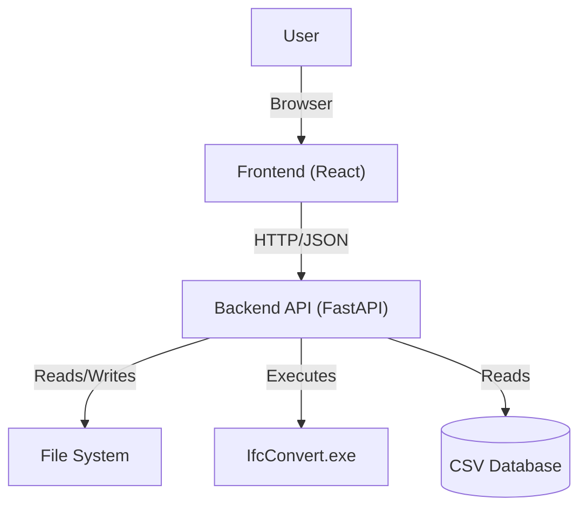
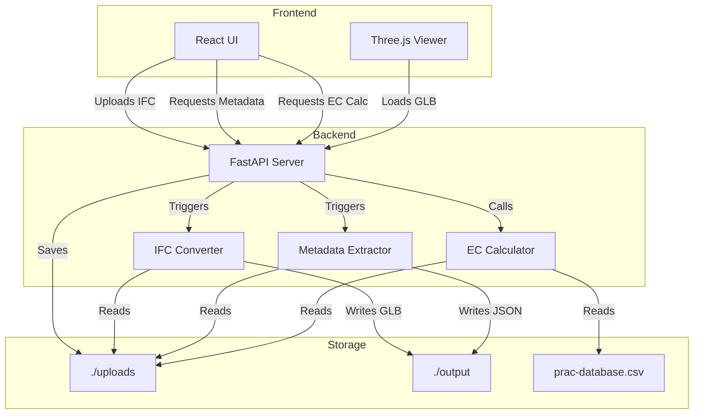

# Architecture Documentation

> **Status**: Living Document  
> **Last Updated**: December 14, 2025  
> **Owner**: Naveen Panditharatne

## 1. Purpose & Scope

The **Digital Twin** application is a web-based BIM (Building Information Modeling) viewer and analysis tool. Its primary purpose is to visualize IFC (Industry Foundation Classes) models in 3D and perform Embodied Carbon (EC) analysis on the building elements.

The system bridges the gap between complex BIM files and accessible web visualization by converting IFC geometry to GLB (glTF Binary) for the frontend while extracting rich metadata and spatial hierarchies for analysis. It specifically targets sustainability workflows by mapping BIM materials to carbon impact factors.

## 2. Key User Journeys

*   **Upload & Process**: A user uploads an `.ifc` file. The system validates it, saves it, and triggers background processes to convert geometry (GLB) and extract metadata (JSON).
*   **3D Visualization**: The user views the 3D model in the browser, navigating via orbit/pan/zoom controls.
*   **Element Inspection**: Clicking a 3D element reveals its specific BIM properties (Psets, quantities, materials) in a side panel.
*   **Embodied Carbon Analysis**: The user triggers an EC calculation. The system maps model materials to a backend database (`prac-database.csv`) and visualizes the carbon footprint (kgCO2e) per element and in aggregate.
*   **Spatial Navigation**: Users can isolate parts of the building (e.g., specific floors or rooms) using the spatial hierarchy tree.

## 3. Repository Tour

### Root Structure
*   `backend/`: Python FastAPI application handling file processing, conversion, and analysis.
*   `frontend/`: React application (Vite) handling the UI and 3D rendering.
*   `package.json`: Root configuration (mostly for frontend workspace management if applicable).

### Backend (`/backend`)
*   `main.py`: **Entrypoint**. Configures the FastAPI app, CORS, and routes.
*   `config.py`: Centralized configuration (paths, constants).
*   `ec_api.py`: API router specifically for Embodied Carbon endpoints.
*   `ec_core.py`: Orchestrator for EC calculations.
*   `domain/`:
    *   `materials.py`: Material classification and extraction logic.
    *   `geometry.py`: IfcOpenShell geometry processing.
*   `ifc_converter.py`: Wrapper around `IfcConvert` to generate GLB files.
*   `ifc_metadata_extractor.py`: Parses IFC files to extract property sets into JSON.
*   `ifc_spatial_hierarchy.py`: Extracts the building tree (Site -> Building -> Storey -> Space -> Element).
*   `prac-database.csv`: The reference database for material carbon factors.
*   `uploads/`: Storage for raw uploaded IFC files.
*   `output/`: Storage for processed artifacts (GLB, JSON).

### Frontend (`/frontend`)
*   `src/main.jsx`: **Entrypoint**. Bootstraps the React application.
*   `src/components/Viewer.jsx`: The core 3D canvas using `@react-three/fiber`.
*   `src/components/EcPanel.jsx`: UI for triggering and displaying EC analysis results.
*   `src/components/PropertyPanel.jsx`: Displays element-specific metadata.
*   `src/components/UploadPanel.jsx`: Handles file selection and upload progress.

## 4. Component Boundaries & Data Flow

### Context Diagram


### Container Diagram


### Data Flow: Embodied Carbon Calculation
1.  **Request**: Frontend sends `POST /api/ec/calculate/{jobId}`.
2.  **Load**: Backend locates the `.ifc` file in `uploads/`.
3.  **Parse**: `ec_core.py` opens the IFC file using `ifcopenshell`.
4.  **Extract**: It iterates through elements, calculating volumes (via geometry or Psets) and identifying materials.
5.  **Map**: Materials are matched against `prac-database.csv` (aggregated by MaterialClass).
6.  **Compute**: Mass = Volume × Density; EC = Mass × Factor.
7.  **Response**: JSON object with summaries (Total tCO2e) and element-level details is returned.
8.  **Render**: Frontend `EcPanel` visualizes the data.

## 5. Dependencies

### Backend
*   **FastAPI**: Web framework.
*   **IfcOpenShell**: Parsing and manipulating IFC files.
*   **Pandas**: Data manipulation for the EC database and material merging.
*   **IfcConvert**: External executable (must be present in `backend/`) for geometry conversion.

### Frontend
*   **React**: UI library.
*   **Vite**: Build tool.
*   **Three.js / React Three Fiber**: 3D rendering engine.
*   **Drei**: Helpers for R3F (OrbitControls, etc.).

## 6. Operational View

### Local Development
*   **Backend**: Runs on `http://localhost:8000`.
    *   Command: `uvicorn main:app --reload` (from `backend/` dir).
    *   Requires: Python 3.10+, `IfcConvert.exe` in path or backend folder.
*   **Frontend**: Runs on `http://localhost:3000`.
    *   Command: `npm run dev` (from `frontend/` dir).
    *   Proxies API requests to localhost:8000 (if configured) or calls directly.

### Environment Variables
*   Currently, configuration (paths, ports) is hardcoded in `main.py` and `vite.config.js`.
*   *Future*: Move `UPLOAD_DIR`, `OUTPUT_DIR`, and CORS origins to `.env`.

## 7. Testing Strategy

*   **Current Status**: No formal automated test suite exists.
*   **Manual Testing**:
    *   Upload a known valid IFC file (e.g., `SampleHouse.ifc`).
    *   Verify 3D model loads.
    *   Verify properties appear on click.
    *   Run EC calculation and check for "Data Coverage" stats.
*   **Future Recommendations**:
    *   **Unit**: Test `ec_core.py` logic with mock IFC elements.
    *   **Integration**: Test API endpoints using `TestClient` from FastAPI.

## 8. Architecture Update Checklist

When making changes, ensure you update this doc if you:
- [ ] Add a new top-level backend module or frontend component.
- [ ] Change the data flow (e.g., adding a database instead of CSV).
- [ ] Add a new external dependency (e.g., Auth0, S3).
- [ ] Change the API contract significantly.

## 9. How to Keep This Updated
*   This file should be reviewed during PRs that touch `main.py` or core logic.
*   Diagrams are generated from Mermaid code blocks; edit the text to update the visuals.

## 10. Helicopter View
To generate a single-file snapshot of the entire repository (useful for LLM context or high-level reviews), run:

```bash
python scripts/helicopter_view.py
```

This creates `HELICOPTER_VIEW.md` in the root, containing the directory tree and the contents of all text files (respecting `.gitignore` and size limits).
