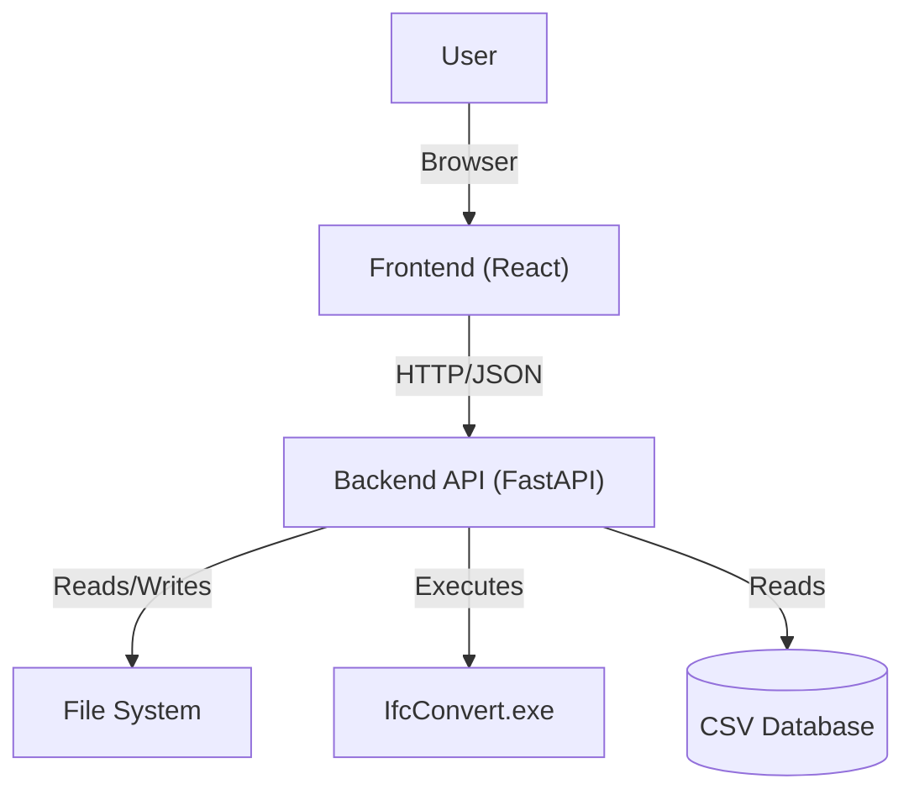
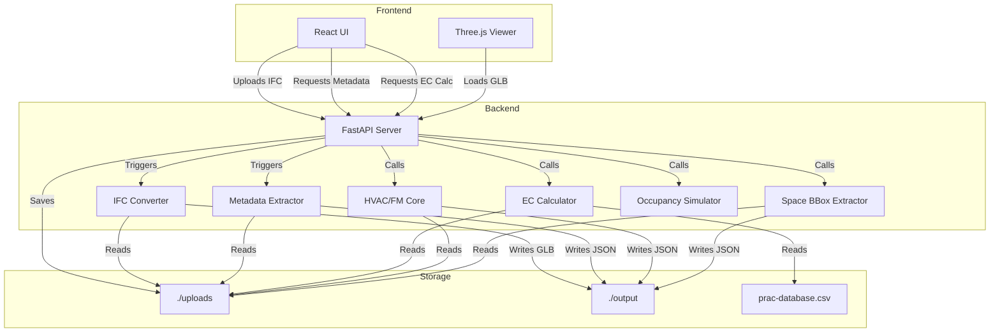

# Architecture Documentation

> **Status**: Living Document  
> **Last Updated**: February 18, 2026  
> **Owner**: Naveen Panditharatne

## Recent additions / changes

- **Date:** 2026-02-18
- **Work Orders module (phase 1-2):** Added geometry-native CMMS work orders with secured API endpoints and an interactive floating panel with model-wide filters, detail editing, and model selection linking.
- **Backend updates:** Added `backend/work_order_models.py` and `backend/work_order_api.py`; extended `backend/db.py` with `work_orders` schema, indexes, and idempotent migration from `maintenance_logs`.
- **Frontend updates:** Added `frontend/src/components/WorkOrdersPanel.jsx`; wired toolbar toggle and floating panel stacking for model-wide work order queue + locate-in-model interaction.

- **Date:** 2026-02-19
- **PropertyPanel transition (phase 3):** Replaced embedded `MaintenanceLog` with a slim `Related Work Orders` section that shows per-element counts and a direct "View in Work Orders" action.
- **Selection linking:** Added an explicit open/focus handler for Work Orders so PropertyPanel can open the CMMS panel filtered to the currently selected element.

- **Date:** 2026-02-18
- **Security hardening (phase 1):** Added authenticated job ownership checks across upload/job/EC/FM/validation/maintenance routes, protected `/files/{job_id}/{filename}` access, hardened upload size/filename validation, and added baseline security headers.
- **Backend updates:** Added `backend/job_security.py` and `model_jobs` table in `backend/db.py` for persistent job-to-user ownership and file-token checks.
- **Frontend updates:** Updated backend fetch calls to send credentials so authenticated endpoints continue to work from the Vite app.

- **Date:** 2026-02-17
- **Authentication:** Added JWT cookie auth with refresh-token rotation, CSRF double-submit protection, audit logging, and auth endpoints under `/auth/*`.
- **Backend updates:** Added `backend/auth_api.py`, `backend/auth_deps.py`, and `backend/auth_models.py`; extended `db.py` schema with `users`, `refresh_tokens`, and `audit_logs`.
- **Frontend updates:** Added route-based auth flow (`react-router-dom`), `useAuth` context, `LoginPage`, `SignupPage`, and shared API wrapper with CSRF header + credentialed requests.

- **Date:** 2026-02-16
- **Floating panel interaction refactor:** Added `frontend/src/components/DraggablePanel.jsx` to centralize drag/resize/focus behavior used by EC, HVAC/FM, IDS Validation, and Occupancy panels.
- **Maintenance impact:** Drag/resize bug fixes now apply across all floating panels from one component instead of four duplicated implementations.

- **Date:** 2026-02-16
- **Maintenance log feature:** Added server-side per-element maintenance logging with SQLite (`backend/maintenance.db`) and REST endpoints under `/api/maintenance/*`.
- **Backend updates:** Added `backend/db.py` (SQLite init/PRAGMA/schema), `backend/maintenance_models.py` (Pydantic request/response models), and `backend/maintenance_api.py` (CRUD + summary router).
- **Frontend updates:** Added `frontend/src/components/MaintenanceLog.jsx` and embedded it in `PropertyPanel` so FM users can create, update, and delete logs directly from selected elements.

- **Date:** 2026-02-16
- **HVAC terminal-link accuracy:** `servedTerminals` now contains only physically connected terminals discovered by port traversal (BFS).
- **HVAC inferred links:** Added `systemAssociatedTerminals` as a separate field for same-system inference so physical vs inferred links are not mixed.
- **Traversal defaults:** Increased HVAC traversal defaults from depth 15/node cap 1500 to depth 35/node cap 3000 for better coverage on longer branch runs.
- **Global search (viewer header):** Added model-wide search in the top header (`GlobalSearch`) that queries `metadata.json` across element IDs, names, IFC type/object type, storey, materials, and property keys/values, independent of the Structure panel state.
- **Selection integration:** Global search selection reuses the same tree-selection focus path (`handleTreeSelect`) and triggers space overlay highlighting when the selected result is an `IfcSpace`.

- **Date:** 2026-01-30
- **FM Sidecar Integration:** Added support for uploading FM parameter sidecar JSON files alongside IFC files. This allows Revit FM parameters to appear in the PropertyPanel without relying on IFC property-set export. The sidecar is merged into `metadata.json` during processing.
- **Backend updates:** Extended `/upload` endpoint to accept optional `fm_params` file; added `fm_params_filename` to `ConversionJob` model; enhanced `fm_sidecar_merger.py` with validation and detailed logging.
- **Frontend updates:** Added optional FM sidecar file picker to `UploadPanel.jsx` with visual feedback.

- **Date:** 2026-01-13
- **EC Detail Coverage:** EC calculation now returns all element rows with computed EC values (no top-200 cap) to support full drilldowns in the UI.

- **Date:** 2026-01-11
- **IFC Validation:** Added a minimal `ifc_validation.py` module so `/validation/{job_id}` endpoints can return reports again.
- **IDS Validation:** Added default IDS templates (`backend/ids_templates`) and a frontend tab for running them.

- **Date:** 2025-12-31
- **Live Occupancy Simulation:** Added synthetic occupancy data generation with time-based patterns (6am–10pm schedule), random walk with mean reversion, and capacity estimation (~10m²/person).
- **Occupancy Backend:** New `occupancy_sim.py` module and API endpoints in `fm_api.py` for get/tick/reset/demo operations.
- **Occupancy Frontend:** `useOccupancy` hook for polling, `OccupancyLegend` (floating summary), `OccupancyPanel` (draggable detail view), and heatmap coloring in `SpaceBboxOverlay` (green→yellow→red gradient).

- **Date:** 2025-12-28
- **Dual X-Ray modes:** Wireframe X-ray for architecture/tree selections and ghosted solids for HVAC selections.
- **HVAC/FM enrichment:** Served spaces include room identifiers (`room_no`, `room_name`) and grouped system names.
- **Space overlays:** Space bbox output now includes a transform for alignment; added Space Navigator UI and no-spaces feedback.

- **Date:** 2025-12-26
- **HVAC/FM analysis:** Added HVAC/FM core and API endpoints to map equipment -> terminals -> spaces; results cached in `output/{job_id}/hvac_fm.json` with room identifiers.
- **Space overlays:** Added space bbox endpoint with cached `space_bboxes.json` for overlay rendering.
- **Frontend updates:** Added HVAC/FM panel and spaces overlay toggle (bbox rendering + selection highlight).

- **Date:** 2025-12-15
- **Implemented EC Overrides:** Added support for overriding embodied carbon at the *material class*, *IFC type*, or *element* level; includes a server-side path to apply **Total EC** overrides distributed across matching rows.
- **Backend updates:** Core calculation and API changes in `backend/ec_core.py` and `backend/ec_api.py` to accept and apply overrides.
- **Frontend updates:** `EcPanel.jsx` includes an overrides modal, improved breakdown UI, and moved visual styling to class-based rules (injected style block) to support consistent `:hover` behavior.
- **Selection & X-Ray fixes:** Resolved edge cases and toggling bugs in `frontend/src/hooks/useSelection.js` and `frontend/src/hooks/useXRayMode.js`.
- **Testing & Notes:** Manual verification completed for override distribution and UI hover states; recommend adding automated integration tests for the override flow.

## 1. Purpose & Scope

The **Digital Twin** application is a web-based BIM (Building Information Modeling) viewer and analysis tool. Its primary purpose is to visualize IFC (Industry Foundation Classes) models in 3D and perform Embodied Carbon (EC) analysis on the building elements.

The system bridges the gap between complex BIM files and accessible web visualization by converting IFC geometry to GLB (glTF Binary) for the frontend while extracting rich metadata and spatial hierarchies for analysis. It specifically targets sustainability workflows by mapping BIM materials to carbon impact factors.

## 2. Key User Journeys

*   **Upload & Process**: A user uploads an `.ifc` file. The system saves it and triggers background processes to convert geometry (GLB) and extract metadata (JSON).
*   **3D Visualization**: The user views the 3D model in the browser, navigating via orbit/pan/zoom controls.
*   **Element Inspection**: Clicking a 3D element reveals its specific BIM properties (Psets, quantities, materials) in a side panel.
*   **Embodied Carbon Analysis**: The user triggers an EC calculation. The system maps model materials to a backend database (`prac-database.csv`) and visualizes the carbon footprint (kgCO2e) per element and in aggregate.
*   **HVAC/FM Analysis**: The user runs HVAC/FM analysis to derive physically served terminals and served spaces from equipment.
*   **Spatial Navigation**: Users can isolate parts of the building (e.g., specific floors or rooms) using the spatial hierarchy tree.
*   **Space Overlay**: Users toggle translucent space bounding boxes for quick room context in the 3D view.
*   **Authentication**: Users sign up/sign in to access the viewer, with cookie-based sessions and CSRF protection.
*   **Maintenance Logging**: Users capture per-element FM actions/notes (inspection, repair, issue) with server-side timestamps and status lifecycle updates.
*   **Work Order Queue**: Users manage model-wide work orders in a dedicated panel and jump to the related element in 3D.
*   **Live Occupancy**: Users enable occupancy simulation to visualize synthetic headcounts per room with a color-coded heatmap (green→yellow→red) and a real-time legend/panel.

## 3. Repository Tour

### Root Structure
*   `backend/`: Python FastAPI application handling file processing, conversion, and analysis.
*   `frontend/`: React application (Vite) handling the UI and 3D rendering.
*   `package.json`: Root configuration (mostly for frontend workspace management if applicable).

### Backend (`/backend`)
*   `main.py`: **Entrypoint**. Configures the FastAPI app, CORS, and routes.
*   `config.py`: Centralized configuration (paths, constants).
*   `auth_api.py`: API router for registration/login/logout/me/refresh/password-reset-stub.
*   `auth_deps.py`: Reusable auth dependencies for resolving current user from access-cookie JWT.
*   `auth_models.py`: Pydantic request/response models for auth endpoints.
*   `db.py`: SQLite helpers and schema initialization for server-side maintenance logs.
*   `ec_api.py`: API router specifically for Embodied Carbon endpoints.
*   `ec_core.py`: Orchestrator for EC calculations.
*   `fm_api.py`: API router for HVAC/FM analysis, space bbox, and occupancy simulation endpoints.
*   `maintenance_api.py`: API router for maintenance logs CRUD and summary queries.
*   `maintenance_models.py`: Pydantic models for maintenance log requests/responses.
*   `work_order_api.py`: API router for work orders CRUD/list/summary endpoints.
*   `work_order_models.py`: Pydantic models for work order requests/responses.
*   `fm_hvac_core.py`: HVAC/FM core logic (equipment -> physically connected terminals -> spaces), plus separate system-associated terminal inference.
*   `validation_api.py`: API router for IFC validation and IDS file workflows.
*   `ifc_validation.py`: Minimal IFC rule checks and report summaries used by validation endpoints.
*   `ids_manager.py`: IDS file management and two-gate validation (Gate 1 XSD schema, Gate 2 ifctester).
*   `ids_templates/`: Default IDS templates available to all jobs.
*   `occupancy_sim.py`: Synthetic occupancy data generation with time-based patterns.
*   `domain/`:
    *   `materials.py`: Material classification and extraction logic.
    *   `geometry.py`: IfcOpenShell geometry processing.
*   `ifc_converter.py`: Wrapper around `IfcConvert` to generate GLB files.
*   `ifc_metadata_extractor.py`: Parses IFC files to extract property sets into JSON.
*   `ifc_spatial_hierarchy.py`: Extracts the building tree (Site -> Building -> Storey -> Space -> Element).
*   `prac-database.csv`: The reference database for material carbon factors.
*   `uploads/`: Storage for raw uploaded IFC files.
*   `output/`: Storage for processed artifacts (GLB, JSON).

### Frontend (`/frontend`)
*   `src/main.jsx`: **Entrypoint**. Bootstraps the React application.
*   `src/pages/LoginPage.jsx`: Login screen for cookie-based auth.
*   `src/pages/SignupPage.jsx`: Signup screen for new local users.
*   `src/hooks/useAuth.js`: Auth context provider and auth action hooks.
*   `src/utils/api.js`: Credentialed fetch wrapper with CSRF header and refresh retry behavior.
*   `src/components/Viewer.jsx`: The core 3D canvas using `@react-three/fiber`.
*   `src/components/DraggablePanel.jsx`: Shared wrapper that handles drag/resize/focus behavior for floating tool panels.
*   `src/components/EcPanel.jsx`: UI for triggering and displaying EC analysis results.
*   `src/components/HvacFmPanel.jsx`: UI for HVAC/FM analysis results and filters.
*   `src/components/WorkOrdersPanel.jsx`: Floating CMMS-style work order queue linked to geometry selection.
*   `src/components/SpaceBboxOverlay.jsx`: Renders space bbox overlays in the viewer (with optional occupancy heatmap).
*   `src/components/SpaceNavigator.jsx`: Cycles and highlights spaces when overlays are enabled.
*   `src/components/OccupancyLegend.jsx`: Floating legend showing live occupancy totals and color scale.
*   `src/components/OccupancyPanel.jsx`: Draggable panel with sortable/filterable occupancy breakdown.
*   `src/hooks/useOccupancy.js`: Hook managing occupancy polling and state.
*   `src/components/PropertyPanel.jsx`: Displays element-specific metadata.
*   `src/components/MaintenanceLog.jsx`: Per-element maintenance log UI embedded in the property panel.
*   `src/components/UploadPanel.jsx`: Landing-page scrollytelling canvas (GSAP) plus file selection and upload progress.

## 4. Component Boundaries & Data Flow

### Context Diagram


### Container Diagram


### Data Flow: Embodied Carbon Calculation
1.  **Request**: Frontend sends `POST /api/ec/calculate/{jobId}`.
2.  **Load**: Backend locates the `.ifc` file in `uploads/`.
3.  **Parse**: `ec_core.py` opens the IFC file using `ifcopenshell`.
4.  **Extract**: It iterates through elements, calculating volumes (via geometry or Psets) and identifying materials.
5.  **Map**: Materials are matched against `prac-database.csv` (aggregated by MaterialClass).
6.  **Compute**: Mass = Volume × Density; EC = Mass × Factor.
7.  **Response**: JSON object with summaries (Total tCO2e) and element-level details is returned.
8.  **Render**: Frontend `EcPanel` visualizes the data.

### Data Flow: HVAC/FM Analysis
1.  **Request**: Frontend sends `POST /api/fm/hvac/analyze/{jobId}`.
2.  **Load**: Backend locates the `.ifc` file in `uploads/`.
3.  **Traverse**: `fm_hvac_core.py` discovers equipment, traverses ports (BFS), and finds physically connected terminals.
4.  **Enrich**: Served spaces are derived from physically connected terminals and include `room_no`, `room_name`, and grouped system names when available.
5.  **Infer (separate field)**: Additional same-system terminals are returned in `systemAssociatedTerminals` and are not merged into `servedTerminals`.
6.  **Cache**: Result JSON is written to `output/{jobId}/hvac_fm.json`.
7.  **Fetch**: Frontend calls `GET /api/fm/hvac/{jobId}` to render results in `HvacFmPanel`.

### Data Flow: Space BBox Overlay
1.  **Request**: Frontend sends `GET /api/spaces/bboxes/{jobId}`.
2.  **Compute**: Backend computes space bboxes using IfcOpenShell geometry.
3.  **Cache**: Result JSON (bbox + transform) is written to `output/{jobId}/space_bboxes.json`.
4.  **Render**: Frontend applies the transform and overlays translucent boxes in `SpaceBboxOverlay`.

### Data Flow: Occupancy Simulation
1.  **Enable**: User toggles "Occupancy" in toolbar; `useOccupancy` hook activates.
2.  **Initial Fetch**: Frontend sends `GET /api/occupancy/{jobId}` to get current snapshot.
3.  **Generate**: Backend `occupancy_sim.py` generates synthetic occupancy using time-based multipliers and capacity estimates (~10m²/person).
4.  **Poll Loop**: Frontend sends `POST /api/occupancy/tick/{jobId}` every 2 seconds.
5.  **Update**: Backend applies random walk with mean reversion toward time-adjusted targets; returns new snapshot.
6.  **Render**: `SpaceBboxOverlay` colors spaces green→yellow→red based on occupancy percentage; `OccupancyLegend` shows totals; `OccupancyPanel` shows detail.

### Data Flow: FM Sidecar Merge
1.  **Export from Revit**: User exports an FM sidecar JSON file (`.fm_params.json`) from the Revit FMReadiness plugin. This file is keyed by IFC GlobalId.
2.  **Upload**: User uploads the IFC file and optionally selects the FM sidecar in `UploadPanel.jsx`.
3.  **Save**: Backend saves both files to `uploads/` with job ID prefix.
4.  **Process**: During IFC processing, after metadata extraction, `fm_sidecar_merger.py` merges FM parameters into `metadata.json`.
5.  **Merge Logic**:
    - Load sidecar JSON and validate structure (keys should be valid IFC GlobalIds).
    - For each GlobalId in sidecar: merge `FMReadiness` and `FMReadinessType` into `elements[GlobalId].properties`.
    - Track statistics: merged count, not-found count, errors.
6.  **Report**: A merge report is saved to `output/{jobId}/fm_merge_report.json` for debugging.
7.  **Display**: `PropertyPanel.jsx` displays the merged FM properties like any other Pset when an element is selected.

### Data Flow: Maintenance Logs
1.  **Select element**: User selects an element in the viewer/tree; frontend has `jobId` and `globalId`.
2.  **Fetch logs**: `MaintenanceLog.jsx` calls `GET /api/maintenance/{jobId}?global_id={globalId}`.
3.  **Store/query**: `maintenance_api.py` runs parameterized SQLite queries against `maintenance_logs`.
4.  **Create log**: Frontend posts `POST /api/maintenance/{jobId}` with element context and note fields.
5.  **Update log**: Frontend patches `PATCH /api/maintenance/{jobId}/{logId}` for status and edits.
6.  **Delete log**: Frontend deletes logs with `DELETE /api/maintenance/{jobId}/{logId}`.
7.  **Summary badges**: Frontend can call `GET /api/maintenance/{jobId}/summary` for status/priority counts.

### Data Flow: Work Orders
1.  **Open queue**: User opens the Work Orders toolbar panel to view model-wide tasks.
2.  **Fetch queue**: `WorkOrdersPanel.jsx` calls `GET /api/work-orders/{jobId}` and `GET /api/work-orders/{jobId}/summary`.
3.  **Create from selection**: Frontend posts `POST /api/work-orders/{jobId}` using the currently selected IFC `GlobalId`.
4.  **Status lifecycle**: Frontend patches `PATCH /api/work-orders/{jobId}/{woId}` to progress status.
5.  **Locate in model**: Clicking a work order triggers viewer selection/focus using `global_id`.
6.  **Soft delete**: Frontend removes an item via `DELETE /api/work-orders/{jobId}/{woId}`.

#### FM Sidecar JSON Contract
```json
{
  "<IFC_GlobalId>": {
    "FMReadiness": {
      "FM_Barcode": "string or null",
      "FM_UniqueAssetId": "string or null",
      "FM_Criticality": "string or null",
      "FM_InstallationDate": "string or null"
    },
    "FMReadinessType": {
      "Manufacturer": "string or null",
      "Model": "string or null",
      "TypeMark": "string or null"
    },
    "_meta": {
      "RevitElementId": 12345,
      "RevitUniqueId": "abc-123",
      "Category": "Mechanical Equipment",
      "Family": "...",
      "TypeName": "..."
    }
  }
}
```

#### FM Sidecar File Locations
- **Input**: `backend/uploads/{job_id}_{filename}.fm_params.json`
- **Output**: Merged into `backend/output/{job_id}/metadata.json`
- **Debug**: `backend/output/{job_id}/fm_merge_report.json`

## 5. Dependencies

### Backend
*   **FastAPI**: Web framework.
*   **IfcOpenShell**: Parsing and manipulating IFC files.
*   **SQLite + aiosqlite**: Lightweight async persistence for maintenance logs, work orders, auth, and job ownership.
*   **Pandas**: Data manipulation for the EC database and material merging.
*   **IfcConvert**: External executable (must be present in `backend/`) for geometry conversion.

### Frontend
*   **React**: UI library.
*   **Vite**: Build tool.
*   **Three.js / React Three Fiber**: 3D rendering engine.
*   **Drei**: Helpers for R3F (OrbitControls, etc.).

## 6. Operational View

### Local Development
*   **Backend**: Runs on `http://localhost:8000`.
    *   Command: `uvicorn main:app --reload` (from `backend/` dir).
    *   Requires: Python 3.10+, `IfcConvert.exe` in path or backend folder.
*   **Frontend**: Runs on `http://localhost:3000`.
    *   Command: `npm run dev` (from `frontend/` dir).
    *   Proxies API requests to localhost:8000 (if configured) or calls directly.

### Environment Variables
*   Currently, configuration (paths, ports) is hardcoded in `main.py` and `vite.config.js`.
*   *Future*: Move `UPLOAD_DIR`, `OUTPUT_DIR`, and CORS origins to `.env`.

## 7. Testing Strategy

*   **Current Status**: No formal automated test suite exists.
*   **Manual Testing**:
    *   Upload a known valid IFC file (e.g., `SampleHouse.ifc`).
    *   Verify 3D model loads.
    *   Verify properties appear on click.
    *   Run EC calculation and check for "Data Coverage" stats.
*   **Future Recommendations**:
    *   **Unit**: Test `ec_core.py` logic with mock IFC elements.
    *   **Integration**: Test API endpoints using `TestClient` from FastAPI.

## 8. Architecture Update Checklist

When making changes, ensure you update this doc if you:
- [ ] Add a new top-level backend module or frontend component.
- [ ] Change the data flow (e.g., adding a database instead of CSV).
- [ ] Add a new external dependency (e.g., Auth0, S3).
- [ ] Change the API contract significantly.

## 9. How to Keep This Updated
*   This file should be reviewed during PRs that touch `main.py` or core logic.
*   Diagrams are generated from Mermaid code blocks; edit the text to update the visuals.

## 10. Helicopter View
To generate a single-file snapshot of the entire repository (useful for LLM context or high-level reviews), run:

```bash
python scripts/helicopter_view.py
```

This creates `HELICOPTER_VIEW.md` in the root, containing the directory tree and the contents of all text files (respecting `.gitignore` and size limits).
