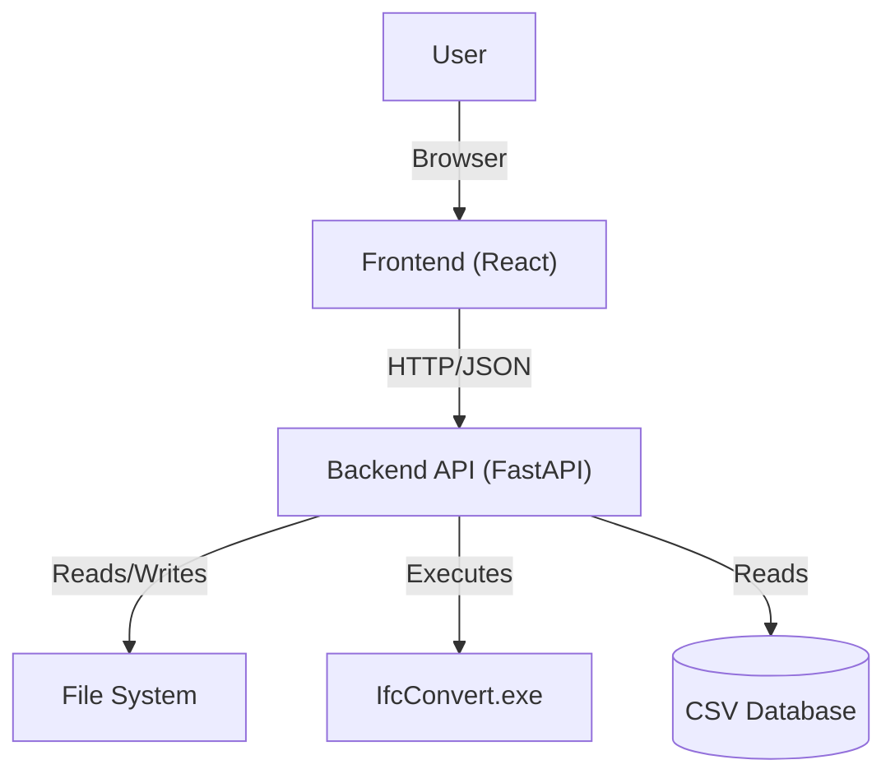
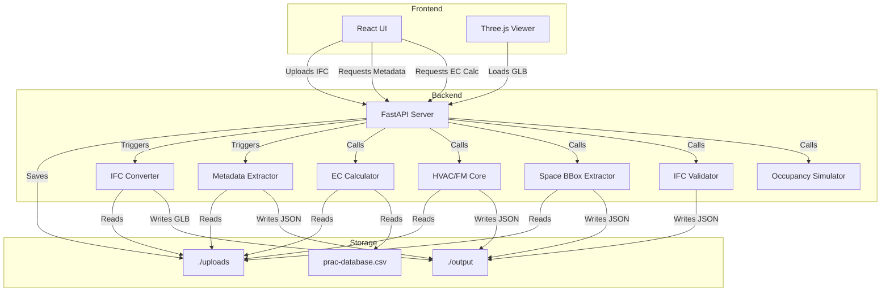

# Architecture Documentation

> **Status**: Living Document  
> **Last Updated**: January 6, 2026  
> **Owner**: Naveen Panditharatne

## Recent additions / changes

- **Date:** 2026-01-06
- **IFC validation pipeline:** Added IDS + coverage validation (`backend/ifc_validation.py`, `backend/validation_api.py`) with cached `validation.json` generated during upload.
- **Validation UI:** Added `ValidationBadge` in the header and `ValidationReportModal` for detailed reports.

- **Date:** 2025-12-31
- **Live Occupancy Simulation:** Added synthetic occupancy data generation with time-based patterns (6am–10pm schedule), random walk with mean reversion, and capacity estimation (~10m²/person).
- **Occupancy Backend:** New `occupancy_sim.py` module and API endpoints in `fm_api.py` for get/tick/reset/demo operations.
- **Occupancy Frontend:** `useOccupancy` hook for polling, `OccupancyLegend` (floating summary), `OccupancyPanel` (draggable detail view), and heatmap coloring in `SpaceBboxOverlay` (green→yellow→red gradient).

- **Date:** 2025-12-28
- **Dual X-Ray modes:** Wireframe X-ray for architecture/tree selections and ghosted solids for HVAC selections.
- **HVAC/FM enrichment:** Served spaces include room identifiers (`room_no`, `room_name`) and grouped system names.
- **Space overlays:** Space bbox output now includes a transform for alignment; added Space Navigator UI and no-spaces feedback.

- **Date:** 2025-12-26
- **HVAC/FM analysis:** Added HVAC/FM core and API endpoints to map equipment -> terminals -> spaces; results cached in `output/{job_id}/hvac_fm.json` with room identifiers.
- **Space overlays:** Added space bbox endpoint with cached `space_bboxes.json` for overlay rendering.
- **Frontend updates:** Added HVAC/FM panel and spaces overlay toggle (bbox rendering + selection highlight).

- **Date:** 2025-12-15
- **Implemented EC Overrides:** Added support for overriding embodied carbon at the *material class*, *IFC type*, or *element* level; includes a server-side path to apply **Total EC** overrides distributed across matching rows.
- **Backend updates:** Core calculation and API changes in `backend/ec_core.py` and `backend/ec_api.py` to accept and apply overrides.
- **Frontend updates:** `EcPanel.jsx` includes an overrides modal, improved breakdown UI, and moved visual styling to class-based rules (injected style block) to support consistent `:hover` behavior.
- **Selection & X-Ray fixes:** Resolved edge cases and toggling bugs in `frontend/src/hooks/useSelection.js` and `frontend/src/hooks/useXRayMode.js`.
- **Testing & Notes:** Manual verification completed for override distribution and UI hover states; recommend adding automated integration tests for the override flow.

## 1. Purpose & Scope

The **Digital Twin** application is a web-based BIM (Building Information Modeling) viewer and analysis tool. Its primary purpose is to visualize IFC (Industry Foundation Classes) models in 3D and perform Embodied Carbon (EC) analysis on the building elements.

The system bridges the gap between complex BIM files and accessible web visualization by converting IFC geometry to GLB (glTF Binary) for the frontend while extracting rich metadata and spatial hierarchies for analysis. It specifically targets sustainability workflows by mapping BIM materials to carbon impact factors.

## 2. Key User Journeys

*   **Upload & Process**: A user uploads an `.ifc` file. The system validates it, saves it, and triggers background processes to convert geometry (GLB) and extract metadata (JSON).
*   **Validation Report**: The user reviews the validation badge and detailed report for IDS rules and domain coverage.
*   **3D Visualization**: The user views the 3D model in the browser, navigating via orbit/pan/zoom controls.
*   **Element Inspection**: Clicking a 3D element reveals its specific BIM properties (Psets, quantities, materials) in a side panel.
*   **Embodied Carbon Analysis**: The user triggers an EC calculation. The system maps model materials to a backend database (`prac-database.csv`) and visualizes the carbon footprint (kgCO2e) per element and in aggregate.
*   **HVAC/FM Analysis**: The user runs HVAC/FM analysis to derive served terminals and served spaces from equipment.
*   **Spatial Navigation**: Users can isolate parts of the building (e.g., specific floors or rooms) using the spatial hierarchy tree.
*   **Space Overlay**: Users toggle translucent space bounding boxes for quick room context in the 3D view.
*   **Live Occupancy**: Users enable occupancy simulation to visualize synthetic headcounts per room with a color-coded heatmap (green→yellow→red) and a real-time legend/panel.

## 3. Repository Tour

### Root Structure
*   `backend/`: Python FastAPI application handling file processing, conversion, and analysis.
*   `frontend/`: React application (Vite) handling the UI and 3D rendering.
*   `package.json`: Root configuration (mostly for frontend workspace management if applicable).

### Backend (`/backend`)
*   `main.py`: **Entrypoint**. Configures the FastAPI app, CORS, and routes.
*   `config.py`: Centralized configuration (paths, constants).
*   `ec_api.py`: API router specifically for Embodied Carbon endpoints.
*   `ec_core.py`: Orchestrator for EC calculations.
*   `fm_api.py`: API router for HVAC/FM analysis, space bbox, and occupancy simulation endpoints.
*   `validation_api.py`: API router for validation endpoints and cached reports.
*   `ifc_validation.py`: IDS + coverage validation rules and report builder.
*   `fm_hvac_core.py`: HVAC/FM core logic (equipment -> terminals -> spaces).
*   `occupancy_sim.py`: Synthetic occupancy data generation with time-based patterns.
*   `domain/`:
    *   `materials.py`: Material classification and extraction logic.
    *   `geometry.py`: IfcOpenShell geometry processing.
*   `ifc_converter.py`: Wrapper around `IfcConvert` to generate GLB files.
*   `ifc_metadata_extractor.py`: Parses IFC files to extract property sets into JSON.
*   `ifc_spatial_hierarchy.py`: Extracts the building tree (Site -> Building -> Storey -> Space -> Element).
*   `prac-database.csv`: The reference database for material carbon factors.
*   `uploads/`: Storage for raw uploaded IFC files.
*   `output/`: Storage for processed artifacts (GLB, JSON including validation).

### Frontend (`/frontend`)
*   `src/main.jsx`: **Entrypoint**. Bootstraps the React application.
*   `src/components/Viewer.jsx`: The core 3D canvas using `@react-three/fiber`.
*   `src/components/EcPanel.jsx`: UI for triggering and displaying EC analysis results.
*   `src/components/HvacFmPanel.jsx`: UI for HVAC/FM analysis results and filters.
*   `src/components/SpaceBboxOverlay.jsx`: Renders space bbox overlays in the viewer (with optional occupancy heatmap).
*   `src/components/SpaceNavigator.jsx`: Cycles and highlights spaces when overlays are enabled.
*   `src/components/ValidationBadge.jsx`: Header badge showing validation status.
*   `src/components/ValidationReportModal.jsx`: Modal for detailed validation results and recommendations.
*   `src/components/OccupancyLegend.jsx`: Floating legend showing live occupancy totals and color scale.
*   `src/components/OccupancyPanel.jsx`: Draggable panel with sortable/filterable occupancy breakdown.
*   `src/hooks/useOccupancy.js`: Hook managing occupancy polling and state.
*   `src/components/PropertyPanel.jsx`: Displays element-specific metadata.
*   `src/components/UploadPanel.jsx`: Handles file selection and upload progress.

## 4. Component Boundaries & Data Flow

### Context Diagram


### Container Diagram


### Data Flow: Embodied Carbon Calculation
1.  **Request**: Frontend sends `POST /api/ec/calculate/{jobId}`.
2.  **Load**: Backend locates the `.ifc` file in `uploads/`.
3.  **Parse**: `ec_core.py` opens the IFC file using `ifcopenshell`.
4.  **Extract**: It iterates through elements, calculating volumes (via geometry or Psets) and identifying materials.
5.  **Map**: Materials are matched against `prac-database.csv` (aggregated by MaterialClass).
6.  **Compute**: Mass = Volume × Density; EC = Mass × Factor.
7.  **Response**: JSON object with summaries (Total tCO2e) and element-level details is returned.
8.  **Render**: Frontend `EcPanel` visualizes the data.

### Data Flow: HVAC/FM Analysis
1.  **Request**: Frontend sends `POST /api/fm/hvac/analyze/{jobId}`.
2.  **Load**: Backend locates the `.ifc` file in `uploads/`.
3.  **Traverse**: `fm_hvac_core.py` discovers equipment, traverses ports, and maps terminals to spaces.
4.  **Enrich**: Served spaces include `room_no`, `room_name`, and grouped system names when available.
5.  **Cache**: Result JSON is written to `output/{jobId}/hvac_fm.json`.
6.  **Fetch**: Frontend calls `GET /api/fm/hvac/{jobId}` to render results in `HvacFmPanel`.

### Data Flow: Space BBox Overlay
1.  **Request**: Frontend sends `GET /api/spaces/bboxes/{jobId}`.
2.  **Compute**: Backend computes space bboxes using IfcOpenShell geometry.
3.  **Cache**: Result JSON (bbox + transform) is written to `output/{jobId}/space_bboxes.json`.
4.  **Render**: Frontend applies the transform and overlays translucent boxes in `SpaceBboxOverlay`.

### Data Flow: IFC Validation
1.  **Trigger**: Upload processing runs validation after conversion and metadata extraction.
2.  **Validate**: `ifc_validation.py` evaluates IDS rules and domain coverage metrics.
3.  **Cache**: Report is saved to `output/{jobId}/validation.json`.
4.  **Fetch**: `validation_api.py` serves cached results via `GET /validation/{jobId}` and summary via `GET /validation/{jobId}/summary`.
5.  **Render**: `ValidationBadge` and `ValidationReportModal` display status and details.

### Data Flow: Occupancy Simulation
1.  **Enable**: User toggles "Occupancy" in toolbar; `useOccupancy` hook activates.
2.  **Initial Fetch**: Frontend sends `GET /api/occupancy/{jobId}` to get current snapshot.
3.  **Generate**: Backend `occupancy_sim.py` generates synthetic occupancy using time-based multipliers and capacity estimates (~10m²/person).
4.  **Poll Loop**: Frontend sends `POST /api/occupancy/tick/{jobId}` every 2 seconds.
5.  **Update**: Backend applies random walk with mean reversion toward time-adjusted targets; returns new snapshot.
6.  **Render**: `SpaceBboxOverlay` colors spaces green→yellow→red based on occupancy percentage; `OccupancyLegend` shows totals; `OccupancyPanel` shows detail.

## 5. Dependencies

### Backend
*   **FastAPI**: Web framework.
*   **IfcOpenShell**: Parsing and manipulating IFC files.
*   **Pandas**: Data manipulation for the EC database and material merging.
*   **IfcConvert**: External executable (must be present in `backend/`) for geometry conversion.
*   **ifctester**: IDS validation engine used by IFC validation.

### Frontend
*   **React**: UI library.
*   **Vite**: Build tool.
*   **Three.js / React Three Fiber**: 3D rendering engine.
*   **Drei**: Helpers for R3F (OrbitControls, etc.).

## 6. Operational View

### Local Development
*   **Backend**: Runs on `http://localhost:8000`.
    *   Command: `uvicorn main:app --reload` (from `backend/` dir).
    *   Requires: Python 3.10+, `IfcConvert.exe` in path or backend folder.
*   **Frontend**: Runs on `http://localhost:3000`.
    *   Command: `npm run dev` (from `frontend/` dir).
    *   Proxies API requests to localhost:8000 (if configured) or calls directly.

### Environment Variables
*   Currently, configuration (paths, ports) is hardcoded in `main.py` and `vite.config.js`.
*   *Future*: Move `UPLOAD_DIR`, `OUTPUT_DIR`, and CORS origins to `.env`.

## 7. Testing Strategy

*   **Current Status**: No formal automated test suite exists.
*   **Manual Testing**:
    *   Upload a known valid IFC file (e.g., `SampleHouse.ifc`).
    *   Verify 3D model loads.
    *   Verify properties appear on click.
    *   Run EC calculation and check for "Data Coverage" stats.
*   **Future Recommendations**:
    *   **Unit**: Test `ec_core.py` logic with mock IFC elements.
    *   **Integration**: Test API endpoints using `TestClient` from FastAPI.

## 8. Architecture Update Checklist

When making changes, ensure you update this doc if you:
- [ ] Add a new top-level backend module or frontend component.
- [ ] Change the data flow (e.g., adding a database instead of CSV).
- [ ] Add a new external dependency (e.g., Auth0, S3).
- [ ] Change the API contract significantly.

## 9. How to Keep This Updated
*   This file should be reviewed during PRs that touch `main.py` or core logic.
*   Diagrams are generated from Mermaid code blocks; edit the text to update the visuals.

## 10. Helicopter View
To generate a single-file snapshot of the entire repository (useful for LLM context or high-level reviews), run:

```bash
python scripts/helicopter_view.py
```

This creates `HELICOPTER_VIEW.md` in the root, containing the directory tree and the contents of all text files (respecting `.gitignore` and size limits).
