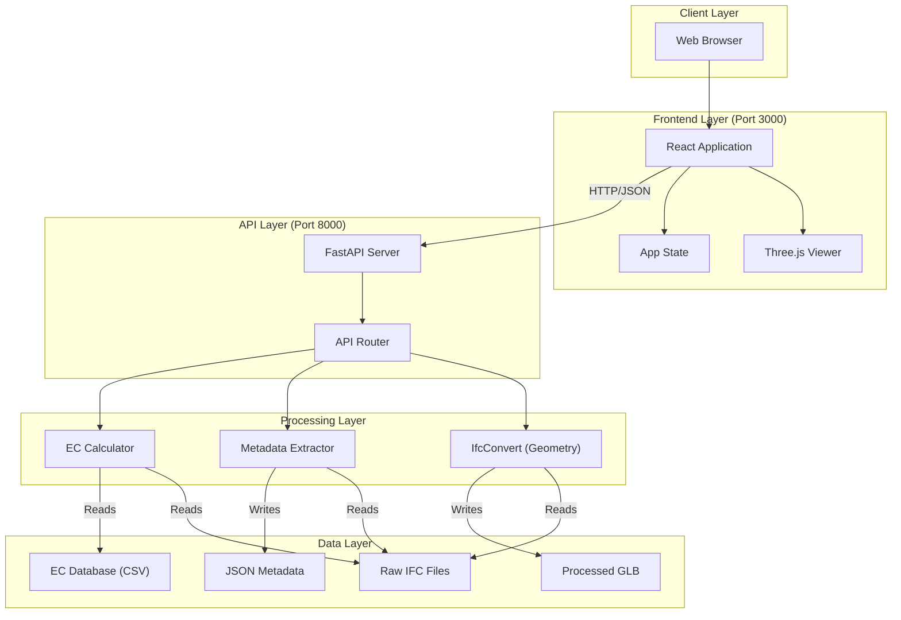
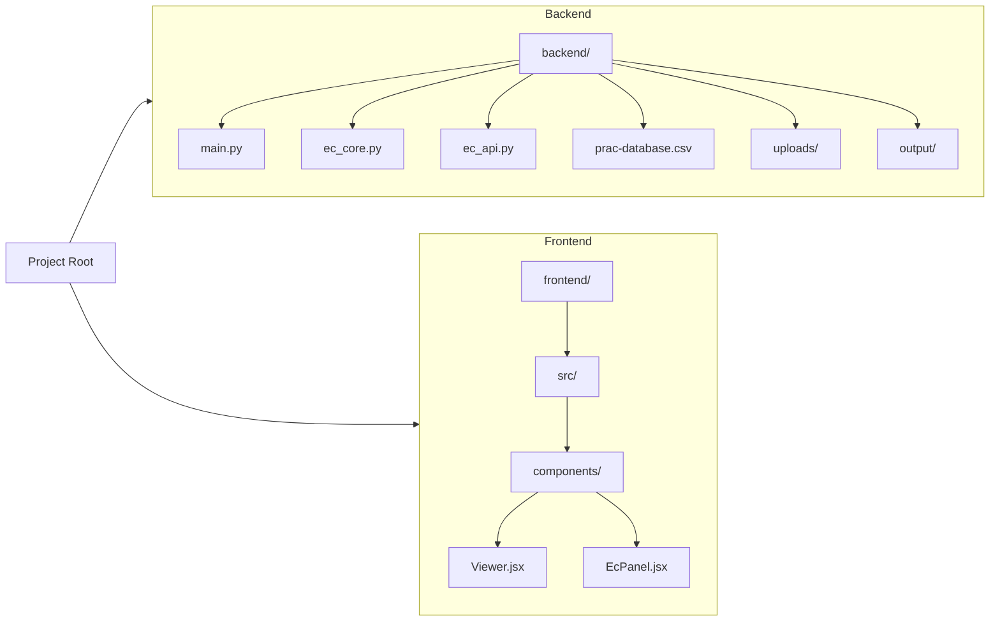

# System Map

This document provides a high-level visual map of the Digital Twin system components and their interactions.

## System Overview

## Directory Structure Map

## Key Workflows

### 1. File Upload & Processing

### 2. Embodied Carbon Analysis

